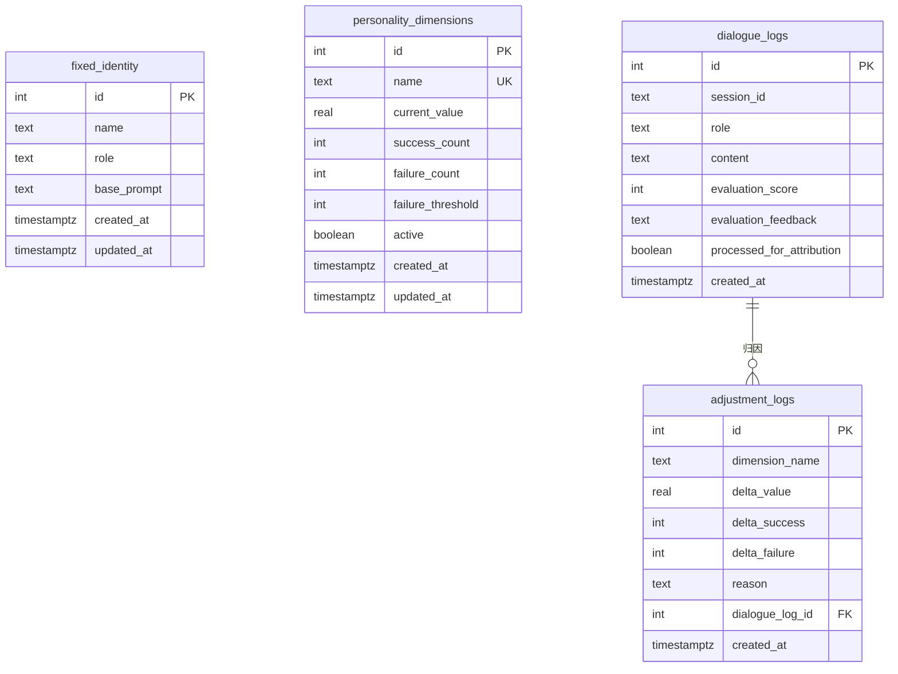

# 数据库设计

mr.data 使用 PostgreSQL 作为结构化数据存储，保存固定身份、性格维度、对话记录和归因调整日志。

---

## 表清单

| 表名 | 说明 |
|------|------|
| `fixed_identity` | 固定身份：名称、角色、基础设定 |
| `personality_dimensions` | 性格维度：当前值、成功/失败计数、淘汰阈值 |
| `dialogue_logs` | 对话记录：用户与助手的每轮消息及评估反馈 |
| `adjustment_logs` | 归因调整日志：离线任务对维度的每次调整 |

---

## `fixed_identity`

保存 mr.data 的固定身份和基础人设。通常只有一条记录。

| 字段 | 类型 | 说明 |
|------|------|------|
| `id` | SERIAL PK | 自增主键 |
| `name` | TEXT | 名称，例如 `mr.data` |
| `role` | TEXT | 角色描述 |
| `base_prompt` | TEXT | 基础系统提示词 |
| `created_at` | TIMESTAMPTZ | 创建时间 |
| `updated_at` | TIMESTAMPTZ | 更新时间 |

---

## `personality_dimensions`

保存可调整的动态性格维度。每个维度有一个当前值和成功/失败计数，失败次数超过阈值时会被淘汰（`active = FALSE`）。

| 字段 | 类型 | 说明 |
|------|------|------|
| `id` | SERIAL PK | 自增主键 |
| `name` | TEXT UNIQUE | 维度名称，例如 `幽默感`、`直接性` |
| `current_value` | REAL | 当前值，范围 [-1.0, 1.0] |
| `success_count` | INTEGER | 成功次数 |
| `failure_count` | INTEGER | 失败次数 |
| `failure_threshold` | INTEGER | 淘汰阈值，默认 5 |
| `active` | BOOLEAN | 是否仍活跃，默认 TRUE |
| `created_at` | TIMESTAMPTZ | 创建时间 |
| `updated_at` | TIMESTAMPTZ | 更新时间 |

### 默认维度

初始化时会插入以下维度：

- 幽默感
- 直接性
- 同理心
- 好奇心
- 防御性

---

## `dialogue_logs`

保存每次会话中的用户输入和助手回复，用于在线记忆和离线归因分析。

| 字段 | 类型 | 说明 |
|------|------|------|
| `id` | SERIAL PK | 自增主键 |
| `session_id` | TEXT | 会话 ID |
| `role` | TEXT | 角色：`user` 或 `assistant` |
| `content` | TEXT | 消息内容 |
| `evaluation_score` | INTEGER | 评估分数：-1（差）、0（中）、1（好），可为空 |
| `evaluation_feedback` | TEXT | 评估反馈文字，可为空 |
| `processed_for_attribution` | BOOLEAN | 是否已被离线归因处理，默认 FALSE |
| `created_at` | TIMESTAMPTZ | 创建时间 |

### 索引

```sql
CREATE INDEX idx_dialogue_session ON dialogue_logs(session_id);
CREATE INDEX idx_dialogue_processed ON dialogue_logs(processed_for_attribution);
```

---

## `adjustment_logs`

记录离线归因任务对性格维度的每一次调整，便于审计和回滚分析。

| 字段 | 类型 | 说明 |
|------|------|------|
| `id` | SERIAL PK | 自增主键 |
| `dimension_name` | TEXT | 被调整的维度名称 |
| `delta_value` | REAL | 维度值变化量 |
| `delta_success` | INTEGER | 成功计数变化量 |
| `delta_failure` | INTEGER | 失败计数变化量 |
| `reason` | TEXT | 调整原因 |
| `dialogue_log_id` | INTEGER FK → `dialogue_logs(id)` | 关联的对话记录 |
| `created_at` | TIMESTAMPTZ | 创建时间 |

---

## 关系图



---

## 数据流

1. **在线对话**：`dialogue_logs` 持续写入 `user` 和 `assistant` 消息。
2. **评估反馈**：用户或自动评估为助手回复打分，更新 `evaluation_score` 和 `evaluation_feedback`。
3. **离线归因**：读取未处理的 `dialogue_logs`，分析后更新 `personality_dimensions`。
4. **审计**：每次更新写入 `adjustment_logs`。
