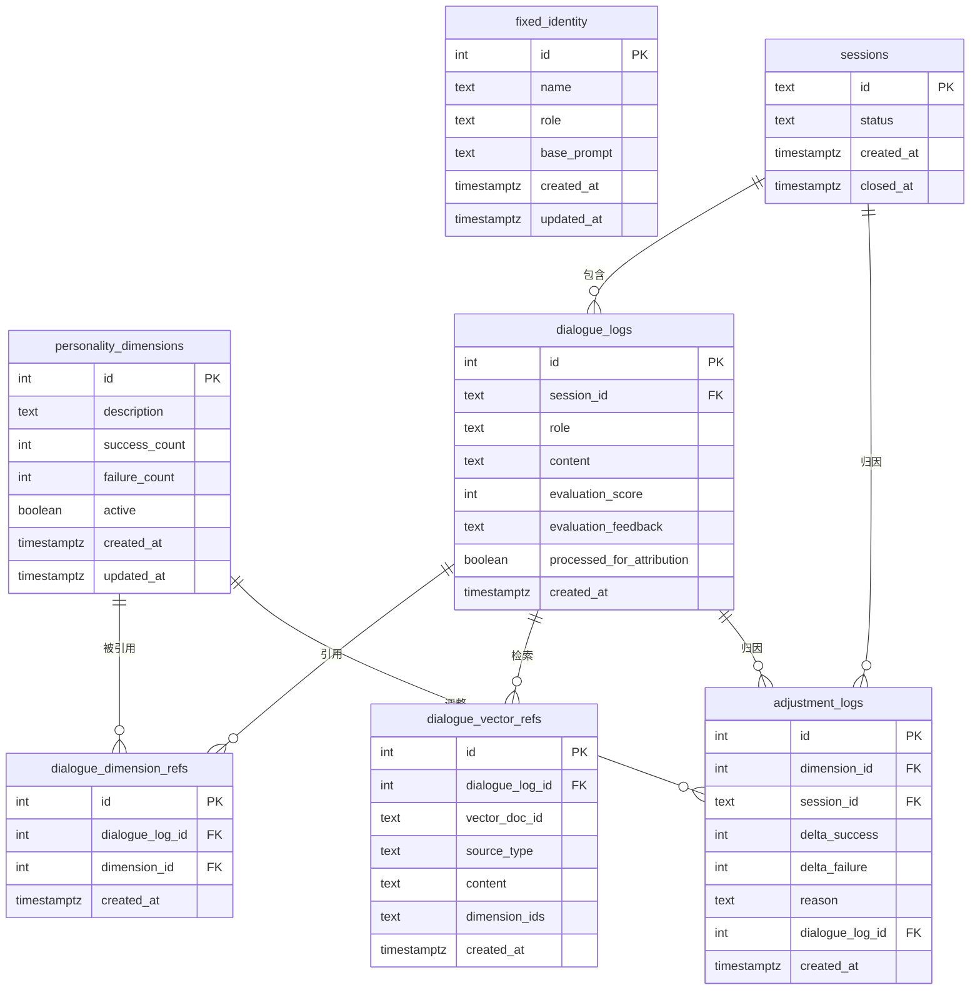

# 数据库设计

mr.data 使用 PostgreSQL 作为结构化数据存储，保存固定身份、性格维度、会话、对话记录、对话引用和归因调整日志。

---

## 表清单

| 表名 | 说明 |
|------|------|
| `fixed_identity` | 固定身份：名称、角色、基础设定 |
| `personality_dimensions` | 性格维度：描述性自白、成功/失败计数 |
| `sessions` | 会话：标记对话的语义边界 |
| `dialogue_logs` | 对话记录：用户与助手的每轮消息及评估反馈 |
| `dialogue_dimension_refs` | 对话引用的基础性格维度 |
| `dialogue_vector_refs` | 对话检索到的向量素材快照 |
| `adjustment_logs` | 归因调整日志：离线任务对维度的每次调整 |

---

## `fixed_identity`

保存 mr.data 的固定身份和基础人设。通常只有一条记录。

| 字段 | 类型 | 说明 |
|------|------|------|
| `id` | SERIAL PK | 自增主键 |
| `name` | TEXT | 名称，例如 `mr.data` |
| `role` | TEXT | 角色描述 |
| `base_prompt` | TEXT | 基础系统提示词 |
| `created_at` | TIMESTAMPTZ | 创建时间 |
| `updated_at` | TIMESTAMPTZ | 更新时间 |

---

## `personality_dimensions`

保存可调整的动态性格维度。每个维度是一段描述性自白，并记录成功/失败计数，失败次数超过系统阈值时会被淘汰（`active = FALSE`）。

| 字段 | 类型 | 说明 |
|------|------|------|
| `id` | SERIAL PK | 自增主键 |
| `description` | TEXT | 基础性格描述，类似自白 |
| `success_count` | INTEGER | 成功次数 |
| `failure_count` | INTEGER | 失败次数 |
| `active` | BOOLEAN | 是否仍活跃 |
| `created_at` | TIMESTAMPTZ | 创建时间 |
| `updated_at` | TIMESTAMPTZ | 更新时间 |

- 没有 `name` 字段：避免 LLM 归因产生同名不同义的性格时无法入库。
- 没有 `current_value`：后续只参考成功/失败数据。
- 没有 `failure_threshold`：淘汰阈值是系统级设置，放在 `.env` / `config.py` 中。

### 默认维度示例

```text
我相信轻松的表达能拉近距离。我会用机智、反讽或意想不到的比喻来回应，但绝不冒犯对方。
```

```text
面对问题时，我倾向于直切核心。我认为含糊其辞比错误答案更浪费时间，所以会尽量给出明确的判断。
```

---

## `sessions`

保存对话会话，用于为离线归因提供语义边界。

| 字段 | 类型 | 说明 |
|------|------|------|
| `id` | TEXT PK | 会话 ID（UUID 字符串） |
| `status` | TEXT | `active` 或 `closed` |
| `created_at` | TIMESTAMPTZ | 创建时间 |
| `closed_at` | TIMESTAMPTZ | 关闭时间 |

- 用户通过 `/newsession` 或退出 CLI 结束当前会话，旧会话标记为 `closed`。
- 离线归因只处理状态为 `closed` 且包含未处理对话的会话。

---

## `dialogue_logs`

保存每次会话中的用户输入和助手回复，用于在线记忆和离线归因分析。

| 字段 | 类型 | 说明 |
|------|------|------|
| `id` | SERIAL PK | 自增主键 |
| `session_id` | TEXT FK → `sessions(id)` | 会话 ID |
| `role` | TEXT | 角色：`user` 或 `assistant` |
| `content` | TEXT | 消息内容 |
| `evaluation_score` | INTEGER | 评估分数：-1（差）、0（中）、1（好），可为空 |
| `evaluation_feedback` | TEXT | 评估反馈文字，可为空 |
| `processed_for_attribution` | BOOLEAN | 是否已被离线归因处理，默认 FALSE |
| `created_at` | TIMESTAMPTZ | 创建时间 |

### 索引

```sql
CREATE INDEX idx_dialogue_session ON dialogue_logs(session_id);
CREATE INDEX idx_dialogue_processed ON dialogue_logs(processed_for_attribution);
```

---

## `dialogue_dimension_refs`

记录每次助手回复时，系统提示词中加载了哪些基础性格维度。

| 字段 | 类型 | 说明 |
|------|------|------|
| `id` | SERIAL PK | 自增主键 |
| `dialogue_log_id` | INTEGER FK → `dialogue_logs(id)` | 关联的助手回复 |
| `dimension_id` | INTEGER FK → `personality_dimensions(id)` | 使用的性格维度 |
| `created_at` | TIMESTAMPTZ | 创建时间 |

- 与向量素材分离，避免基础性格和向量内容的笛卡尔积。
- 唯一约束：`(dialogue_log_id, dimension_id)`。

---

## `dialogue_vector_refs`

记录每次助手回复时，从 Chroma `personality` 集合或网络搜索实际检索到的素材。

| 字段 | 类型 | 说明 |
|------|------|------|
| `id` | SERIAL PK | 自增主键 |
| `dialogue_log_id` | INTEGER FK → `dialogue_logs(id)` | 关联的助手回复 |
| `vector_doc_id` | TEXT | Chroma 中的文档 ID 或网络结果 ID |
| `source_type` | TEXT | `line`、`event` 或 `web` |
| `content` | TEXT | 向量库/网络返回的文本快照 |
| `dimension_ids` | TEXT | 该素材关联的维度 ID 列表，逗号分隔 |
| `created_at` | TIMESTAMPTZ | 创建时间 |

- 一条助手回复可对应多条向量素材记录。
- 向量内容只保存一次；通过 `dimension_ids` 字段保留它与基础维度的关系。
- 至少保留向量库返回的文本；同时保留 `vector_doc_id` 便于反向追溯。

### 索引

```sql
CREATE INDEX idx_vector_ref_dialogue ON dialogue_vector_refs(dialogue_log_id);
```

---

## `adjustment_logs`

记录离线归因任务对性格维度的每一次调整，便于审计和回滚分析。

| 字段 | 类型 | 说明 |
|------|------|------|
| `id` | SERIAL PK | |
| `dimension_id` | INTEGER FK → `personality_dimensions(id)` | 维度 ID |
| `session_id` | TEXT FK → `sessions(id)` | 所属会话，可为空 |
| `delta_success` | INTEGER | 成功计数变化 |
| `delta_failure` | INTEGER | 失败计数变化 |
| `reason` | TEXT | 原因 |
| `dialogue_log_id` | INTEGER FK → `dialogue_logs(id)` | 关联对话 |
| `created_at` | TIMESTAMPTZ | |

- 不再记录 `delta_value`（已移除 `current_value`）。
- `session_id` 用于追溯一次归因来自哪个已关闭会话。

---

## 关系图



---

## 数据流

1. **在线对话**：`dialogue_logs` 持续写入 `user` 和 `assistant` 消息，每条消息归属一个 `sessions` 记录。
2. **记录引用**：助手回复写入后，同时写入：
   - `dialogue_dimension_refs`：本次加载了哪些基础维度。
   - `dialogue_vector_refs`：从 Chroma 或网络检索到了哪些素材及其文本快照。
3. **评估反馈**：用户或自动评估为助手回复打分，更新 `evaluation_score` 和 `evaluation_feedback`。
4. **会话结束**：用户输入 `/newsession` 或退出 CLI 时，当前 `sessions` 记录标记为 `closed`。
5. **离线归因**：只读取状态为 `closed` 且包含未处理对话的会话，按会话分析后更新 `personality_dimensions`。
6. **动态创建维度**：LLM 归因发现新性格时，插入新的 `personality_dimensions` 记录。
7. **审计**：每次更新写入 `adjustment_logs`，并记录 `session_id`。
