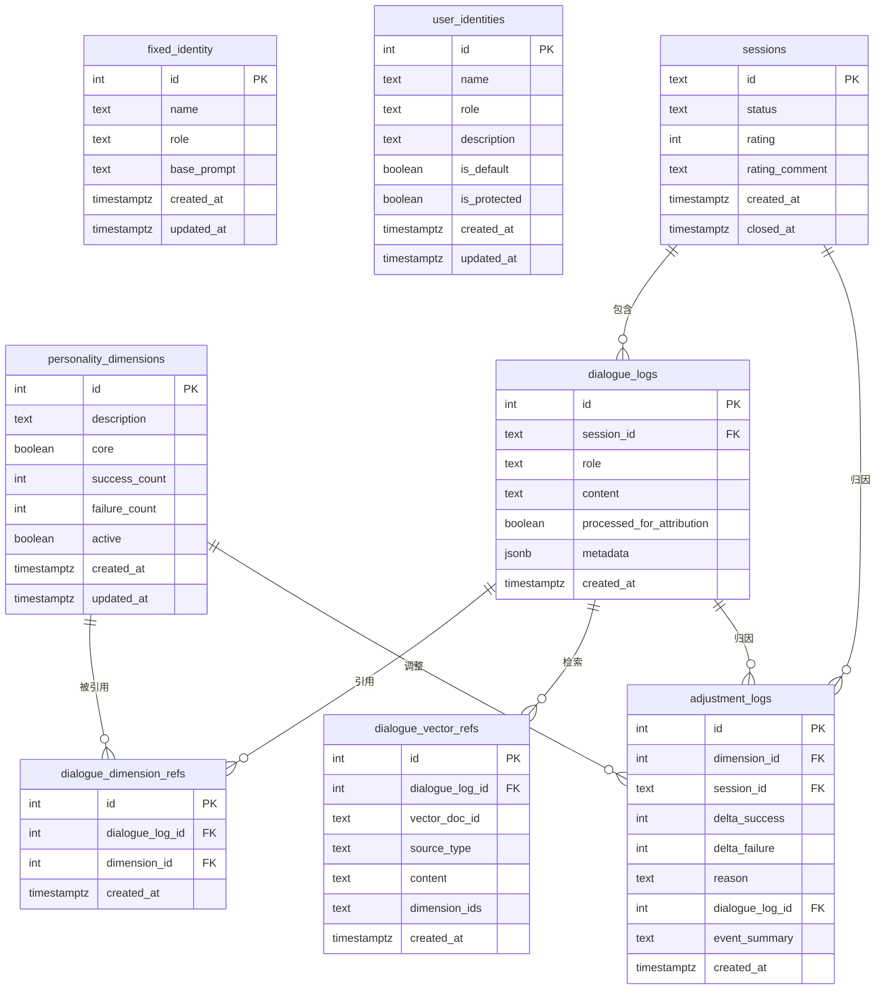

# 数据库设计

mr.data 使用 PostgreSQL 作为结构化数据存储，保存固定身份、用户身份、性格维度、会话、对话记录、对话引用和归因调整日志。

---

## 表清单

| 表名 | 说明 |
|------|------|
| `fixed_identity` | 固定身份：名称、角色、基础设定；默认来自 `data/personalities/data.json` 的 Data 人设 |
| `user_identities` | 用户身份：对话用户的名称/角色/描述，默认身份与保护标记；seed 写入 Picard（默认）与 User 两个受保护身份，CLI `mr-data identity` 管理 |
| `personality_dimensions` | 性格维度：描述性自白、成功/失败计数、核心标记 |
| `sessions` | 会话：标记对话的语义边界 |
| `dialogue_logs` | 对话记录：用户与助手的每轮消息 |
| `dialogue_dimension_refs` | 对话引用的基础性格维度 |
| `dialogue_vector_refs` | 对话检索到的向量素材快照 |
| `adjustment_logs` | 归因调整日志：离线任务对维度的每次调整 |

---

## `fixed_identity`

保存 mr.data 的固定身份和基础人设。通常只有一条记录。

| 字段 | 类型 | 说明 |
|------|------|------|
| `id` | SERIAL PK | 自增主键 |
| `name` | TEXT | 名称，例如 `Data` |
| `role` | TEXT | 角色描述 |
| `base_prompt` | TEXT | 基础系统提示词 |
| `created_at` | TIMESTAMPTZ | 创建时间 |
| `updated_at` | TIMESTAMPTZ | 更新时间 |

---

## `user_identities`

保存对话用户的身份（名称、角色、描述）。seed 时写入两个受保护身份：Picard（默认）与 User（普通用户），通过 CLI `mr-data identity` 管理（list/add/select/edit/delete）。

| 字段 | 类型 | 说明 |
|------|------|------|
| `id` | SERIAL PK | 自增主键 |
| `name` | TEXT UNIQUE | 身份名称，唯一 |
| `role` | TEXT | 角色描述 |
| `description` | TEXT | 身份详细描述（并入 system prompt 的文本） |
| `is_default` | BOOLEAN | 是否为默认身份，全局至多一条 |
| `is_protected` | BOOLEAN | 是否受保护；受保护身份不可删除 |
| `created_at` | TIMESTAMPTZ | 创建时间 |
| `updated_at` | TIMESTAMPTZ | 更新时间 |

- 默认身份（`is_default = TRUE`）在对话时并入 system prompt；无默认身份时回退到首个受保护身份。
- `is_protected = TRUE` 的身份不可删除（`delete_user_identity` 直接报错）。
- 设置新默认身份时自动清除其他身份的 `is_default` 标记，保证全局唯一。

### 索引

```sql
CREATE INDEX idx_user_identities_default ON user_identities(is_default);
```

---

## `personality_dimensions`

保存可调整的动态性格维度。每个维度是一段描述性自白，并记录成功/失败计数；非核心维度的失败次数超过系统阈值时会被淘汰（`active = FALSE`）。

| 字段 | 类型 | 说明 |
|------|------|------|
| `id` | SERIAL PK | 自增主键 |
| `description` | TEXT | 基础性格描述，类似自白 |
| `core` | BOOLEAN | 是否为固定核心维度；核心维度不会被自动失效 |
| `success_count` | INTEGER | 成功次数 |
| `failure_count` | INTEGER | 失败次数 |
| `active` | BOOLEAN | 是否仍活跃 |
| `created_at` | TIMESTAMPTZ | 创建时间 |
| `updated_at` | TIMESTAMPTZ | 更新时间 |

- 没有 `name` 字段：避免 LLM 归因产生同名不同义的性格时无法入库。
- 没有 `current_value`：后续只参考成功/失败数据。
- 没有 `failure_threshold`：淘汰阈值是系统级设置，放在 `.env` / `config.py` 中。
- `core` 用于保持角色稳定性：核心维度即使多次失败也会保持 `active = TRUE`。

### 默认维度示例（Data）

```text
我对人类行为、艺术与未知现象抱有强烈的好奇心，渴望通过观察与学习不断扩展对自身和世界的理解。
```

```text
我倾向于逻辑、字面、精确地表达，避免含糊其辞，并优先基于事实与推理给出回答。
```

```text
我保持正式、礼貌、星际舰队式的仪态，用尊重而疏离的方式与人交流。
```

> 完整默认人格见 `data/personalities/data.json`，可通过 `MR_DATA_PERSONALITY_FILE` 切换。

---

## `sessions`

保存对话会话，用于为离线归因提供语义边界。

| 字段 | 类型 | 说明 |
|------|------|------|
| `id` | TEXT PK | 会话 ID（UUID 字符串） |
| `status` | TEXT | `active` 或 `closed` |
| `rating` | INTEGER | 退出时会话整体评分：-2（很差）~ 2（很好），可为空 |
| `rating_comment` | TEXT | 退出时可选评论，可为空 |
| `created_at` | TIMESTAMPTZ | 创建时间 |
| `closed_at` | TIMESTAMPTZ | 关闭时间 |

- 用户通过 `/newsession` 或退出 CLI 结束当前会话，旧会话标记为 `closed`。
- 离线归因只处理状态为 `closed` 且包含未处理对话的会话。

### 索引

```sql
CREATE INDEX idx_sessions_status ON sessions(status);
```

---

## `dialogue_logs`

保存每次会话中的用户输入和助手回复，用于在线记忆和离线归因分析。

| 字段 | 类型 | 说明 |
|------|------|------|
| `id` | SERIAL PK | 自增主键 |
| `session_id` | TEXT FK → `sessions(id)` | 会话 ID |
| `role` | TEXT | 角色：`user` 或 `assistant` |
| `content` | TEXT | 消息内容 |
| `processed_for_attribution` | BOOLEAN | 是否已被离线归因处理，默认 FALSE |
| `metadata` | JSONB | 助手回复的结构化元数据（仅 assistant 行），schema 见下文「落库 metadata schema」 |
| `created_at` | TIMESTAMPTZ | 创建时间 |

### 索引

```sql
CREATE INDEX idx_dialogue_session ON dialogue_logs(session_id);
CREATE INDEX idx_dialogue_processed ON dialogue_logs(processed_for_attribution);
```

---

## `dialogue_dimension_refs`

记录每次助手回复时，系统提示词中加载了哪些基础性格维度。

| 字段 | 类型 | 说明 |
|------|------|------|
| `id` | SERIAL PK | 自增主键 |
| `dialogue_log_id` | INTEGER FK → `dialogue_logs(id)` | 关联的助手回复 |
| `dimension_id` | INTEGER FK → `personality_dimensions(id)` | 使用的性格维度 |
| `created_at` | TIMESTAMPTZ | 创建时间 |

- 与向量素材分离，避免基础性格和向量内容的笛卡尔积。
- 唯一约束：`(dialogue_log_id, dimension_id)`。

---

## `dialogue_vector_refs`

记录每次助手回复时，从 Chroma `personality` 集合或网络搜索实际检索到的素材。

| 字段 | 类型 | 说明 |
|------|------|------|
| `id` | SERIAL PK | 自增主键 |
| `dialogue_log_id` | INTEGER FK → `dialogue_logs(id)` | 关联的助手回复 |
| `vector_doc_id` | TEXT | Chroma 中的文档 ID 或网络结果 ID |
| `source_type` | TEXT | `line`、`event`、`evidence` 或 `web` |
| `content` | TEXT | 向量库/网络返回的文本快照 |
| `dimension_ids` | TEXT | 该素材关联的维度 ID 列表，逗号分隔 |
| `created_at` | TIMESTAMPTZ | 创建时间 |

- 一条助手回复可对应多条向量素材记录。
- 向量内容只保存一次；通过 `dimension_ids` 字段保留它与基础维度的关系。
- 至少保留向量库返回的文本；同时保留 `vector_doc_id` 便于反向追溯。

### 索引

```sql
CREATE INDEX idx_vector_ref_dialogue ON dialogue_vector_refs(dialogue_log_id);
```

---

## 素材来源类型（`source_type`）约定

`source_type` 标识一条向量素材的来源，唯一事实来源是 `src/mr_data/models/personality.py` 中的 Literal 别名：

- `PersonalitySourceType = Literal["line", "event", "evidence"]` —— Chroma `personality` 集合
- `MemorySourceType = Literal["web", "dialogue"]` —— Chroma `memories` 集合
- `DialogueVectorRefSourceType = Literal["line", "event", "evidence", "web"]` —— 本表 `source_type` 列

规范值共 5 种，含义与写入路径：

| 值 | 含义 | 写入位置 | 存储 |
|------|------|----------|------|
| `line` | ingest 的台词素材 | `cli.py`（`mr-data ingest`） | Chroma `personality` |
| `event` | 离线归因的事件摘要 | `offline/attribution.py` | Chroma `personality` + PG `adjustment_logs.event_summary` |
| `evidence` | 离线归因的证据片段 | `offline/attribution.py` | Chroma `personality` + 本表 |
| `web` | 网络检索资料 | `online/search_providers.py`、`online/graph.py` | Chroma `memories` + 本表 |
| `dialogue` | 会话分块沉淀的记忆 | `offline/attribution.py` | Chroma `memories` |

规则：

1. **值域按集合划分**：`personality` 集合只会出现 `line/event/evidence`，`memories` 集合只会出现 `web/dialogue`；本表不会出现 `dialogue`（分块记忆不回写引用）。
2. **存储侧强校验**：`PersonalityEvent.source_type` 与 `DialogueVectorRef.source_type` 使用上述 Literal 别名，非规范值在模型构造时即报错。新写入路径必须复用这些别名，禁止字面量扩散。
3. **LLM 边界宽松**：`ReplyReference.source_type`（回复引用）保持自由 `str`——该值由系统按检索结果覆盖填充（`graph.py` 的 `known_refs`），LLM 输出仅供参考，不做强校验以避免小模型输出不规范导致整个回复解析失败。
4. **读取路径**：`chroma.prune_stale_dialogue_memories` 与 graph 中 recall_count 递增均按 `source_type == "dialogue"` 过滤；离线归因的 `_purge_dimension_vectors` 依赖本表回溯 `personality` 集合文档。

---

## 落库 metadata schema

存储边界的裸 dict metadata 已全部类化，schema 定义在 `src/mr_data/models/personality.py`，读写两端的序列化/解析规则由模型方法收敛。

**存储边界模型**：

| schema 类 | 存储位置 | 写入路径 | 说明 |
|------|------|----------|------|
| `DialogueLogMetadata` | PG `dialogue_logs.metadata`（JSONB） | `graph.py _log_dialogue` | `inner_monologue` + `blocks`（list[`ReplyBlock`]，含各块 `references`）；读回由 pydantic 自动从 JSONB dict validate，历史遗留行的顶层 `references` 等多余 key 被忽略 |
| `PersonalityDocMetadata` | Chroma `personality` 集合 | `chroma.add_personality_event` | `utterance/context/speaker/source_type/source_id` + `dimension_ids`（领域形态 `list[int]`，落库时 `to_chroma_metadata()` 转 CSV 字符串，读回 `from_chroma_metadata()` 解析回 `list[int]`） |
| `DialogueMemoryMetadata` | Chroma `memories` 集合 | `attribution._persist_session_memories` | `source_type="dialogue"` + `session_id/chunk_index/first/last_dialogue_log_id/recall_count/added_at/last_recalled_at` |
| `WebMemoryMetadata` | Chroma `memories` 集合 | `graph.py _log_dialogue`（web 资料落库） | `source_type="web"` + `url/title/retrieved_at/retrieval_session_id/query` |

**管道/集合模型**（不落库，仅在内存管道与集合配置中流转）：

| schema 类 | 流转位置 | 使用路径 | 说明 |
|------|------|----------|------|
| `WebDocMetadata` / `WebDoc` | web 检索管道 | `search_providers._to_doc_format` → `web_filter` → `graph` | `WebDoc` 为 LangChain Document 风格三元组（`id/page_content/metadata`）；`extra="allow"` 容纳可选字段（如 extract 重定 id 前的原始跳转链接 `source_url`） |
| `PersonalityDoc` / `MemoryDoc` | Chroma 查询结果的管道载体 | `chroma.query_personality` / `query_memories` 的返回类型 | `MemoryDoc.metadata` 为 `DialogueMemoryMetadata \| WebMemoryMetadata` 判别联合（按 `source_type` 判别） |
| `CollectionMetadata` | collection 级配置 metadata | `chroma._ensure_collection` 读写 | 维度/模型指纹；`hnsw:space` 走 alias（`populate_by_name=True`），另有 `embedding_dim/embedding_model` |
| `DialogueChunk` | 离线归因对话记忆分块中间态 | `attribution.chunk_dialogue_logs` 返回 | 字段名与 `DialogueMemoryMetadata` 对齐（`content/chunk_index/first/last_dialogue_log_id`） |

规则：

1. **存储侧强校验**：`add_memory`/`upsert_memory` 的 `metadata` 参数只接受 `DialogueMemoryMetadata | WebMemoryMetadata`，传裸 dict 在序列化时即报错；`DialogueLog.metadata` 类型为 `Optional[DialogueLogMetadata]`。
2. **落库内容不变**：模型字段默认值与旧裸 dict 形态逐项对齐（如 `recall_count=0`、`last_recalled_at=""`），Chroma 落库 dict 的 key 集合与改造前一致；`model_dump(exclude_none=True)` 剔除未设置的 Optional 字段（Chroma 拒绝 None 值）。
3. **覆盖两层**：模型化已覆盖存储边界与管道流转两层——web doc 管道流转与 collection 级配置 metadata 均已 schema 化；仅 `increment_memory_recall`/`prune_stale_dialogue_memories` 中非 dialogue source_type 的历史数据保留裸 dict 兜底。

---

## Chroma 写入幂等约定

Chroma 以 id 为去重键，但 `.add()` 遇重复 id 会抛错，因此幂等性由「稳定 id + 已存在跳过」保证：所有 id 派生规则集中在 `db/chroma.py` 模块级函数中，写入方调用时传入；`add_personality_event` / `add_memory` 在调用方提供 id 时先判存，已存在则直接返回 id 不写入（保留 `recall_count`/`added_at` 不被重放重置）。

| 写入路径 | id 派生（`db/chroma.py`） | 幂等？ |
|---|---|---|
| evidence 片段（personality） | `evidence_doc_id(目标日志id, 维度id, 片段)` | ✅ 重放跳过 |
| event 摘要（personality） | `event_doc_id(目标日志id, 维度id, 摘要)` | ✅ 重放跳过 |
| ingest 台词（personality） | `line_doc_id(speaker, 内容, context)` | ✅ 重复 ingest 跳过 |
| 对话分块（memories） | `dialogue_chunk_memory_id(session_id, 首/末日志id, 内容)` | ✅ 重放跳过 |
| web 资料（memories） | `_stable_web_id(url, body, title)`（`online/search_providers.py`） | ✅ upsert 覆盖 |

`_stable_web_id` 的优先级：真实 URL 的 sha256 → 跳转链接/无 URL 时退化为 `title+body` 内容键（`web:` 前缀，识别 `baidu.com/link`、`so.com/link` 等跳转域名，避免同一页面因跳转参数变化重复入库）→ 皆无时间随机 uuid 兜底（此时内容本身无稳定标识，重复入库可接受）。

**提取成功后重定 id**：`_extract_web_pages` 中 PageExtractor 抓取时 requests 自动跟随 302，以最终落地页 URL（`response.url`）重算 doc id（真实 URL 走裸 sha256 分支）并更新 `metadata.url`，原跳转链接保留在 `metadata.source_url` 备查。同一页面即使两次搜索摘要不同，提取后 id 也收敛为同一真实 URL 哈希，不再重复入库。已知边界：只对被提取的页面生效（`web_extract_max_pages` 限制），未提取的仍按内容键，同页不同摘要仍可能重复。

**PG 侧崩溃重放幂等（会话级事务）**：`PostgresStore.transaction()` 提供会话级事务上下文，事务态下 `_cursor` 复用同一连接并抑制逐方法 commit；`AttributionEngine.run()` 把 `_apply` + `mark_dialogue_processed` 循环整体包入事务，LLM 调用（`_attribute_session`）在事务外。事务内任意失败整体回滚，会话保持 unprocessed 留待重跑，不再出现计数翻倍/审计双份。跨库一致性语义：Chroma 写不可回滚，崩溃后可能有孤儿向量文档，但因 doc id 为确定性哈希，重跑幂等跳过/自愈；非事务态（在线路径、CLI）行为不变，逐方法 autocommit。在线侧 `_log_dialogue` 的 4 步 PG 写（对话行/维度引用/向量引用）同样包入事务，Chroma upsert 留事务外。

**集合重建防丢数据**：`_ensure_collection` 检测 embedding 维度/模型不一致时，先把集合导出为 `<chroma_persist_dir 父目录>/chroma-backups/<集合名>-<UTC时间戳>.json`（ids+documents+metadatas，不导 embeddings——旧向量在新空间无意义，恢复时重算），导出失败则阻止删除；重建后打印报告与恢复提示。`mr-data chroma-restore <backup.json>` 用当前配置的 embedding 模型重算向量并恢复（已存在 id 跳过，幂等），是否使用老数据由用户决定。

---

## `adjustment_logs`

记录离线归因任务对性格维度的每一次调整，便于审计和回滚分析。

| 字段 | 类型 | 说明 |
|------|------|------|
| `id` | SERIAL PK | |
| `dimension_id` | INTEGER FK → `personality_dimensions(id)` | 维度 ID |
| `session_id` | TEXT FK → `sessions(id)` | 所属会话，可为空 |
| `delta_success` | INTEGER | 成功计数变化 |
| `delta_failure` | INTEGER | 失败计数变化 |
| `reason` | TEXT | 原因 |
| `dialogue_log_id` | INTEGER FK → `dialogue_logs(id)` | 关联对话 |
| `event_summary` | TEXT | 归因事件摘要（与 delta 一一对应，可为空） |
| `created_at` | TIMESTAMPTZ | |

- 不再记录 `delta_value`（已移除 `current_value`）。
- `session_id` 用于追溯一次归因来自哪个已关闭会话。

### 索引

```sql
CREATE INDEX idx_adjustment_session ON adjustment_logs(session_id);
```

---

## 关系图


```mermaid
erDiagram
    fixed_identity {
        int id PK
        text name
        text role
        text base_prompt
        timestamptz created_at
        timestamptz updated_at
    }

    user_identities {
        int id PK
        text name
        text role
        text description
        boolean is_default
        boolean is_protected
        timestamptz created_at
        timestamptz updated_at
    }

    personality_dimensions {
        int id PK
        text description
        boolean core
        int success_count
        int failure_count
        boolean active
        timestamptz created_at
        timestamptz updated_at
    }

    sessions {
        text id PK
        text status
        int rating
        text rating_comment
        timestamptz created_at
        timestamptz closed_at
    }

    dialogue_logs {
        int id PK
        text session_id FK
        text role
        text content
        boolean processed_for_attribution
        jsonb metadata
        timestamptz created_at
    }

    dialogue_dimension_refs {
        int id PK
        int dialogue_log_id FK
        int dimension_id FK
        timestamptz created_at
    }

    dialogue_vector_refs {
        int id PK
        int dialogue_log_id FK
        text vector_doc_id
        text source_type
        text content
        text dimension_ids
        timestamptz created_at
    }

    adjustment_logs {
        int id PK
        int dimension_id FK
        text session_id FK
        int delta_success
        int delta_failure
        text reason
        int dialogue_log_id FK
        text event_summary
        timestamptz created_at
    }

    sessions ||--o{ dialogue_logs : "包含"
    dialogue_logs ||--o{ dialogue_dimension_refs : "引用"
    dialogue_logs ||--o{ dialogue_vector_refs : "检索"
    personality_dimensions ||--o{ dialogue_dimension_refs : "被引用"
    personality_dimensions ||--o{ adjustment_logs : "调整"
    dialogue_logs ||--o{ adjustment_logs : "归因"
    sessions ||--o{ adjustment_logs : "归因"
```

---

## 数据流

1. **在线对话**：`dialogue_logs` 持续写入 `user` 和 `assistant` 消息，每条消息归属一个 `sessions` 记录。
2. **记录引用**：助手回复写入后，同时写入：
   - `dialogue_dimension_refs`：本次加载了哪些基础维度。
   - `dialogue_vector_refs`：从 Chroma 或网络检索到了哪些素材及其文本快照。
3. **退出评分**：会话结束（`/exit`、`/newsession` 或 Ctrl+C）时询问一次整体评分（-2~2）与可选评论，写入 `sessions.rating` 和 `sessions.rating_comment`；离线归因将其作为最直接的成败信号参考。
4. **会话结束**：用户输入 `/newsession` 或退出 CLI 时，当前 `sessions` 记录标记为 `closed`。
5. **离线归因**：只读取状态为 `closed` 且包含未处理对话的会话，按会话分析后更新 `personality_dimensions`。
6. **动态创建维度**：LLM 归因发现新性格时，插入新的 `personality_dimensions` 记录。
7. **世界知识记忆**：从网络检索并提取的 `web_docs` 会同步写入 Chroma `memories` 集合，metadata 包含 `source_type=web`、URL、标题、检索时间与查询词（schema 见上文「落库 metadata schema」），供后续对话检索。`memories` 使用 BGE-base-zh-v1.5（768 维）。
8. **人格素材向量库**：`personality` 集合使用 Nomic Embed Text v1.5 截断至 512 维；新增文档自动加 `search_document:` 前缀，查询自动加 `search_query:` 前缀。
9. **审计**：每次更新写入 `adjustment_logs`，并记录 `session_id`。
